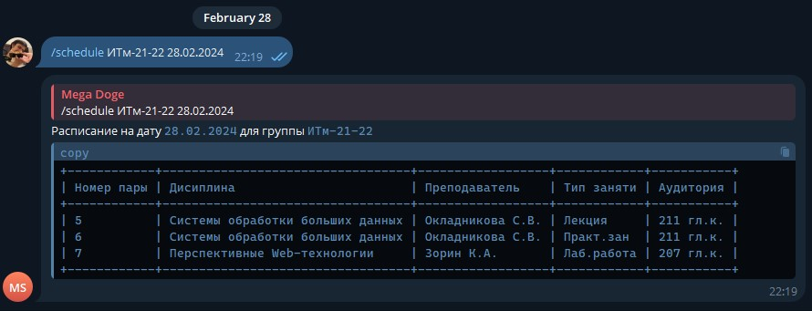

### MS Schedule Bot

Telegram-бот для получения расписания с учетом группы и даты (АГАСУ)


### Команды

- #### Запуск `/start`
  - Запуск бота.
- #### Получение расписания для группы на конкретный день `/schedule номер-группы дата`
  - Если группа и дата указана корретно, в ответ бот пришлет отформатированную таблицу с расписание занятий.

### Установка

1. Склонировать проект
2. Создать и активировать виртуальное окружение

```
python -m venv venv && .\venv\Scripts\activate
```

3. Установить пакеты из `requirements.txt`

```
pip install -r requirements.txt
```

4. Скопировать `config.example.py` как `config.py`
5. Заполнить `config.py`
6. Запустить бота командой

```
python .\main.py
```

### АГАСУ API

Решение использует API АГАСУ https://xn--80aai1dk.xn--p1ai/api/
